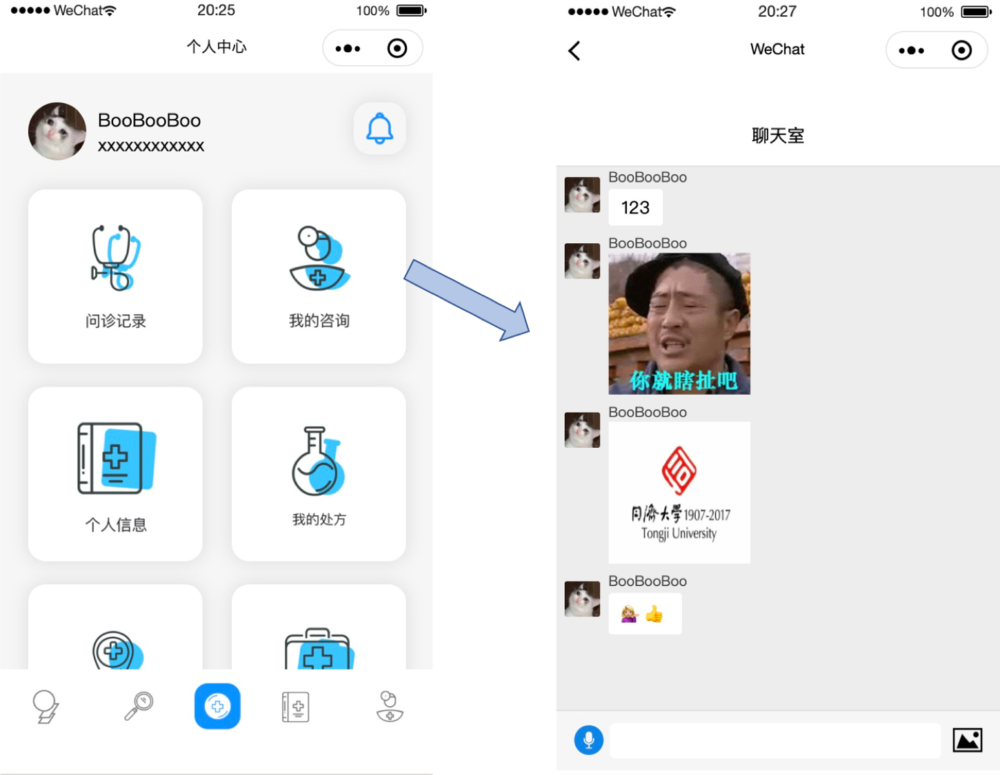

# CloudDoctor
Small APP for Remote Inquiry

##4.7日更新

>李波

- 新增chatroom聊天室功能，支持发送文字、表情、图像、语音。目前语音部分在真机调试方面存在一些问题，如果在真机调试出现问题欢迎大家及时反馈问题截图和报错

- 目前chatroom聊天室入口放在了“我的咨询”按钮处，如果后续需要调整可以修改
- 按照正常的业务逻辑，每次用户进入聊天室前，应当从后段获取一个订单序列号作为进入聊天室的groupid，目前这一订单序列号采用静态字符串模拟的方式，为"a3510731313"（pages/personal/personal.js），后续需要修改
- **运行聊天室功能前，请保证开启了云开发服务**，即点击调试工具左上角“云开发”按钮，一步一步按要求设置即可。配置完成后等大约10分钟左右就可以使用云环境了。在运行程序前，请进入app.js修改wx.cloud.init函数内的env参数为你申请的云环境id

Chatroom预览效果：

